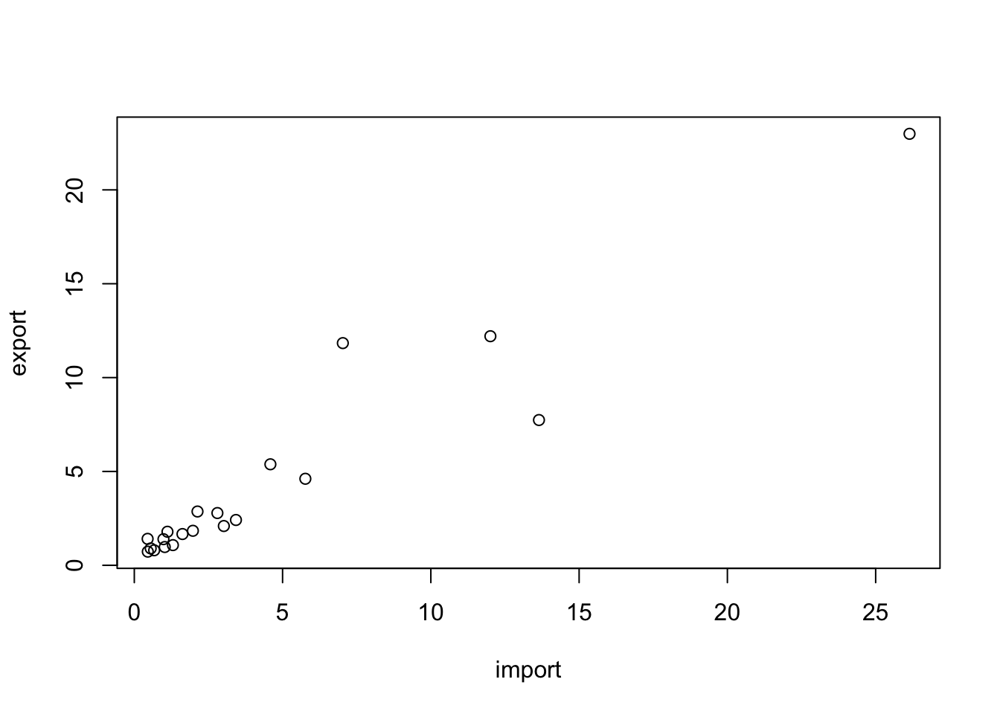

# DataFrame

DataFrame 是 R 語言中最常用的資料結構之一，它是一種表格形式的數據集，類似於 Excel 表格或 SQL 資料表。每一列代表一個變數（Variable），而每一行代表一個觀測值（Observation）。

DataFrame 具備以下特性：

-   **列（Row）**：每一列都是一個完整的觀測數據。

-   **欄（Column）**：每一欄是相同型態的變數，例如數字、文字、因子等。

-   **索引（Index）**：R 自動為 DataFrame 的列加上索引，方便存取數據。

## 基本操作

### 產生新的Dataframe

在 R 中，可以透過 `data.frame()` 函數將數個等長的向量（Vectors）合併為 DataFrame。例如，我們建立台北市各行政區的基本資料，包括區名、面積（平方公里）和人口數（2023 年估計值）。

-   用以下ChatGPT問句來產生測試資料「我現在正在準備R的教學範例， 請協助我產生台北市所有行政區的資料，包含行政區名、面積、人口數 分別指給town, area, population三個變數」。


```r
town = c("松山區", "信義區", "大安區", "中山區", "中正區", "大同區", "萬華區", "文山區", "南港區", "內湖區", "士林區", "北投區")

area = c(9.2878, 11.2077, 11.3614, 13.6821, 7.6071, 5.6815, 8.8522, 31.5090, 21.8424, 31.5787, 62.3682, 56.8216) # 單位：平方公里

population = c(206375, 225561, 309835, 203276, 159608, 132397, 194160, 275207, 122103, 287726, 288324, 255688)  # 2023年的估計值
```

#### 合併等長vector為DataFrame

-   `data.frame(town, population, area)`：將三個向量合併成一個 DataFrame。

-   `df$density <- df$population / df$area`：新增一欄「人口密度」，計算方式為人口數除以區域面積。

-   `str(df)`：顯示 DataFrame 的結構資訊。

-   `summary(df)`：輸出基本統計摘要，例如平均數、中位數、最小值、最大值等。


```r
df <- data.frame(town, population, area)
df$density = df$population / df$area
str(df)
```

```{.output}
## 'data.frame':	6 obs. of  4 variables:
##  $ town      : chr  "中正" "大同" "中山" "松山" ...
##  $ population: num  158228 126687 228075 204903 308383 ...
##  $ area      : num  7.61 5.68 13.68 9.29 11.36 ...
##  $ density   : num  20800 22298 16670 22062 27143 ...
```

```r
summary(df)
```

```{.output}
##      town             population          area           density     
##  Length:6           Min.   :126687   Min.   : 5.681   Min.   :16670  
##  Class :character   1st Qu.:165651   1st Qu.: 7.918   1st Qu.:20907  
##  Mode  :character   Median :196412   Median : 9.070   Median :21645  
##                     Mean   :202366   Mean   : 9.412   Mean   :21700  
##                     3rd Qu.:222282   3rd Qu.:10.843   3rd Qu.:22239  
##                     Max.   :308383   Max.   :13.682   Max.   :27143
```

```r
# View(df)
```

#### 範例：臺灣貿易各國進出口量

-   運用[國際貿易署貿易統計系統 (trade.gov.tw)](https://cuswebo.trade.gov.tw/)獲取臺灣進出口貿易資料。


```r
country <- c("CN", "US", "JP", "HK", "KR", "SG", "DE", "MY", "VN", "PH", "TH", "AU", "NL", "SA", "ID", "GB", "IN", "FR", "IT", "AE")

import <- c(26.142, 12.008, 7.032, 13.646, 4.589, 5.768, 2.131, 2.802, 3.428, 3.019, 1.976, 1.118, 1.624, 0.449, 0.983, 1.302, 1.027, 0.553, 0.670, 0.455)

export <- c(22.987, 12.204, 11.837, 7.739, 5.381, 4.610, 2.866, 2.784, 2.414, 2.092, 1.839, 1.788, 1.665, 1.409, 1.391, 1.075, 0.974, 0.899, 0.800, 0.728)
```

#### 合併vector為data.frame

在 R 早期版本中，當我們讀取或創建資料框架（DataFrame）時，R 預設會將字串類型的變數轉換為因子（Factors）。這樣的設計對於統計分析是有益的，因為統計方法通常將文字數據視為類別變數來處理。然而，隨著資料科學領域的快速發展，需要處理大量文字數據的情況日益增多，因此將字串自動轉換為因子可能不再適用於所有情境。


``` r
df <- data.frame(country, import, export)
str(df)
```

``` output
## 'data.frame':	20 obs. of  3 variables:
##  $ country: chr  "CN" "US" "JP" "HK" ...
##  $ import : num  26.14 12.01 7.03 13.65 4.59 ...
##  $ export : num  22.99 12.2 11.84 7.74 5.38 ...
```

自 **R 4.0** 起，R 的預設行為已改變，**現在建立 DataFrame 或讀取數據時，字串變數預設會保持為字串（Character），而不會自動轉換為因子**。這意味著，當我們使用 `data.frame()` 或 `read.csv()` 等函數讀取數據時，除非明確指定，R 不會自動將字串轉換為因子。

如果你在統計分析中仍然希望將文字型態的變數作為類別變數（即因子）處理，你需要手動進行轉換。例如：在合併資料時，若希望所有`Character`變數自動轉換為`Factor`，可以這樣設定：


``` r
df <- data.frame(country, import, export, stringsAsFactors = TRUE)
str(df)
```

``` output
## 'data.frame':	20 obs. of  3 variables:
##  $ country: Factor w/ 20 levels "AE","AU","CN",..: 3 19 11 7 12 17 4 13 20 15 ...
##  $ import : num  26.14 12.01 7.03 13.65 4.59 ...
##  $ export : num  22.99 12.2 11.84 7.74 5.38 ...
```

其他功能：建立一個新且空的`data.frame`。


``` r
df.test <- data.frame()
```

### 觀察dataframe

當我們處理數據框架（dataframe）時，有幾種常用的方法可以幫助我們更好地了解和觀察數據的結構和內容。

1.  `View(df)`: 使用RStudio提供的圖形使用者介面直接觀看dataframe。這個功能允許你直觀地瀏覽整個數據集，方便地查看不同行（變數）和列（觀測值）。這對於初步瞭解數據的分佈和檢查數據的格式特別有用。

2.  `head(df)`: 這個函數用於取出數據框架的前六筆資料（也就是前六列）。這可以讓我們快速概覽數據集的開頭部分，了解數據的基本結構和內容。如果需要查看更多或更少的列，可以向`head`函數傳遞一個額外的參數，如`head(df, n = 10)`來查看前十列。

3.  `class(df)`: 此函數返回該變數的類型。對於dataframe，它將返回"DataFrame"，表明該對象是一個dataframe。了解對象的類型是重要的基礎步驟，尤其是在R中，不同類型的變項能夠做的操作和應用的函數也不同。

4.  `str(df)`: `str`是結構（structure）的縮寫，這個函數提供了dataframe的詳細結構信息，包括變項的數量、變項名稱、變項數據類型以及每個變項前幾個值。這是一個非常強大的函數，用於深入了解數據集的內部結構，特別是當處理大型數據集時。

5.  `summary(df)`: 此函數提供了數據框架的摘要統計信息，包括數值變數的最小值、最大值、中位數、平均值、第一四分位數和第三四分位數，以及因子變數的水平計數。這對於快速獲取數據集的統計概述非常有用。


``` r
# View(df)
head(df)	# get first part of the data.frame
```

``` output
##   country import export
## 1      CN 26.142 22.987
## 2      US 12.008 12.204
## 3      JP  7.032 11.837
## 4      HK 13.646  7.739
## 5      KR  4.589  5.381
## 6      SG  5.768  4.610
```

``` r
class(df)
```

``` output
## [1] "data.frame"
```

``` r
str(df)
```

``` output
## 'data.frame':	20 obs. of  3 variables:
##  $ country: Factor w/ 20 levels "AE","AU","CN",..: 3 19 11 7 12 17 4 13 20 15 ...
##  $ import : num  26.14 12.01 7.03 13.65 4.59 ...
##  $ export : num  22.99 12.2 11.84 7.74 5.38 ...
```

``` r
summary(df)
```

``` output
##     country       import           export      
##  AE     : 1   Min.   : 0.449   Min.   : 0.728  
##  AU     : 1   1st Qu.: 1.016   1st Qu.: 1.312  
##  CN     : 1   Median : 2.054   Median : 1.966  
##  DE     : 1   Mean   : 4.536   Mean   : 4.374  
##  FR     : 1   3rd Qu.: 4.884   3rd Qu.: 4.803  
##  GB     : 1   Max.   :26.142   Max.   :22.987  
##  (Other):14
```

``` r
# look up help
help(summary)
?summary
```

#### 觀察資料維度


``` r
dim(df)
```

``` output
## [1] 20  3
```

``` r
ncol(df)
```

``` output
## [1] 3
```

``` r
nrow(df)
```

``` output
## [1] 20
```

``` r
length(df)
```

``` output
## [1] 3
```

### 操作dataframe

以下將介紹 DataFrame 的基本操作，包括變數提取、變數創建、篩選數據、排序等常見應用。

#### 選擇某變項（Select）

-   `names(df)` 列出變數名稱。
-   `df$發生.現.地點` 顯示該變數內容
-   `df$發生時段` 顯示該變數內容
-   `length(df$發生時段)` 顯示該變數的長度（相當於有幾個）
-   `summary()` 函數可以用來查看數據的基本統計資訊，例如最小值、最大值、平均數、四分位數等：


``` r
names(df)
```

``` output
## [1] "country" "import"  "export"
```

``` r
head(df$export)
```

``` output
## [1] 22.987 12.204 11.837  7.739  5.381  4.610
```

``` r
length(df$import)
```

``` output
## [1] 20
```

``` r
summary(df)
```

``` output
##     country       import           export      
##  AE     : 1   Min.   : 0.449   Min.   : 0.728  
##  AU     : 1   1st Qu.: 1.016   1st Qu.: 1.312  
##  CN     : 1   Median : 2.054   Median : 1.966  
##  DE     : 1   Mean   : 4.536   Mean   : 4.374  
##  FR     : 1   3rd Qu.: 4.884   3rd Qu.: 4.803  
##  GB     : 1   Max.   :26.142   Max.   :22.987  
##  (Other):14
```

#### 創建新變數（Mutate）

-   在 DataFrame 中，我們可以使用 `$` 符號來新增一個變數，並且透過四則運算來計算新變數的值。在 R 中，尤其是未來運用到 dplyr 套件時，會把DataFrame新增一個變項的動作稱為Mutate，亦即透過運算新增變項。
-   這裡容易犯錯的是，要記得跟程式講說你要加總或四則運算的是哪個df的variable。
-   從下面的這個操作中，該data.frame會產生一個新的變數`sub`，這就相當於Excel中的某一行減去某一行，然後把資料放在新的一行。


``` r
df$sub <- df$import - df$export
```

#### 篩選資料（Filter）

-   注意，要告訴程式`import`和`export`是哪個`data.frame`的。

-   `df[,]`為存取`df`中某個區段的數值或某個數值的方法。因此`df[1, 1]`會取出第一行第一列，也就是第一筆資料的第一個vector。`df[2, 3]`則會取出第二筆資料的第三個variable。

-   下面的例子`nrow(df)`為1894，有1894筆資料，所以自然df$import與df$export的長度都是1894。因此，比較這兩個變數的大小會得到一個長度為1894的boolean (logical) variable。因此把這個長度為1894、充滿TRUE和FALSE的logical vector丟進df的row之處，因為取自df，大小判斷式結果的長度自然和原本的df的列數相同。因此當這個TRUE/FALSE被丟在df的列之處，便會篩選出`import`大於`p.xport`的數值。

-   原本的df有五個variable，而上述的操作是篩選資料，所以被篩選的是列，因此行的數量、名稱都不會變。因此，我篩選完後，直接存取這個被篩選過的data.frame的country variable，自然是可以的。


``` r
df
```

``` output
##    country import export    sub
## 1       CN 26.142 22.987  3.155
## 2       US 12.008 12.204 -0.196
## 3       JP  7.032 11.837 -4.805
## 4       HK 13.646  7.739  5.907
## 5       KR  4.589  5.381 -0.792
## 6       SG  5.768  4.610  1.158
## 7       DE  2.131  2.866 -0.735
## 8       MY  2.802  2.784  0.018
## 9       VN  3.428  2.414  1.014
## 10      PH  3.019  2.092  0.927
## 11      TH  1.976  1.839  0.137
## 12      AU  1.118  1.788 -0.670
## 13      NL  1.624  1.665 -0.041
## 14      SA  0.449  1.409 -0.960
## 15      ID  0.983  1.391 -0.408
## 16      GB  1.302  1.075  0.227
## 17      IN  1.027  0.974  0.053
## 18      FR  0.553  0.899 -0.346
## 19      IT  0.670  0.800 -0.130
## 20      AE  0.455  0.728 -0.273
```

``` r
names(df)
```

``` output
## [1] "country" "import"  "export"  "sub"
```

``` r
nrow(df)
```

``` output
## [1] 20
```

``` r
# filter row data by column value
df[df$import > df$export,]
```

``` output
##    country import export   sub
## 1       CN 26.142 22.987 3.155
## 4       HK 13.646  7.739 5.907
## 6       SG  5.768  4.610 1.158
## 8       MY  2.802  2.784 0.018
## 9       VN  3.428  2.414 1.014
## 10      PH  3.019  2.092 0.927
## 11      TH  1.976  1.839 0.137
## 16      GB  1.302  1.075 0.227
## 17      IN  1.027  0.974 0.053
```

``` r
df[df$import > df$export,]$country
```

``` output
## [1] CN HK SG MY VN PH TH GB IN
## Levels: AE AU CN DE FR GB HK ID IN IT JP KR MY NL PH SA SG TH US VN
```

``` r
df[df$import > df$export,1]
```

``` output
## [1] CN HK SG MY VN PH TH GB IN
## Levels: AE AU CN DE FR GB HK ID IN IT JP KR MY NL PH SA SG TH US VN
```

``` r
# 1 row == a data.frame with only one data entry
class(df[df$import > df$export,1])
```

``` output
## [1] "factor"
```

``` r
class(df[,1]) # character vector
```

``` output
## [1] "factor"
```

``` r
class(df[1,]) # data.frame
```

``` output
## [1] "data.frame"
```

``` r
class(unlist(df[1, -1])) # filter the 1st row and select all columns except 1
```

``` output
## [1] "numeric"
```

#### 按某個變數排序（Arrange）

對於DataFrame這樣一個有很多欄位（變項）的資料表，我們常會希望能夠依據哪一個變項從小而大或從大而小做排序。例如依據價格做排序、依據資料建立先後來排序。此時要用 `order()` ，未來在dplyr中會用 `arrange()`。

-   `df.sorted <- df[order(df$import),]`會使得整個df照`import`的大小排序重新做排列。因為`order(df$import)`會把資料照指定順序排列後的位置傳回來，所以把他丟給`df`的列的位置，便會使得`df`的資料照指定的順序排列。 預設是由小到大，加上`decreasing = T`這個參數後變成由大而小。


``` r
# sort rows by df$import column
df.sorted <- df[order(df$import),]
# View(df.sorted)

# sort rows in decreasing order
df.sorted <- df[order(df$import, decreasing = T),]

# add - to column in order() can sort in decreasing order
df.sorted <- df[order(-df$import),]

head(df.sorted)
```

``` output
##   country import export    sub
## 1      CN 26.142 22.987  3.155
## 4      HK 13.646  7.739  5.907
## 2      US 12.008 12.204 -0.196
## 3      JP  7.032 11.837 -4.805
## 6      SG  5.768  4.610  1.158
## 5      KR  4.589  5.381 -0.792
```

## 簡易繪圖

-   `graphics::plot()`為會預載入R的繪圖套件，如果希望繪圖的同時加上回歸線和資料點標籤的話，必須要三行一起執行。


``` r
# plot(df) # raise error, 1st column is a character vector
plot(df[, 2:3])
```



``` r
plot(df[1:10, 2:3])
text(import, export, labels=country, cex= 0.5, pos=3)
lines(1:25, 1:25, col='red')
```


``` r
?plot
```

``` output
## Help on topic 'plot' was found in the following packages:
## 
##   Package               Library
##   base                  /Library/Frameworks/R.framework/Resources/library
##   graphics              /Library/Frameworks/R.framework/Versions/4.4-arm64/Resources/library
## 
## 
## Using the first match ...
```

## 延伸學習

### 預覽dplyr


``` r
library(dplyr)
df <- data.frame(country, import, export, stringsAsFactors = F)
df <- mutate(df, sub = import - export)
filter(df, import > export)
```

``` output
##   country import export   sub
## 1      CN 26.142 22.987 3.155
## 2      HK 13.646  7.739 5.907
## 3      SG  5.768  4.610 1.158
## 4      MY  2.802  2.784 0.018
## 5      VN  3.428  2.414 1.014
## 6      PH  3.019  2.092 0.927
## 7      TH  1.976  1.839 0.137
## 8      GB  1.302  1.075 0.227
## 9      IN  1.027  0.974 0.053
```

``` r
select(df, c(1, 3))
```

``` output
##    country export
## 1       CN 22.987
## 2       US 12.204
## 3       JP 11.837
## 4       HK  7.739
## 5       KR  5.381
## 6       SG  4.610
## 7       DE  2.866
## 8       MY  2.784
## 9       VN  2.414
## 10      PH  2.092
## 11      TH  1.839
## 12      AU  1.788
## 13      NL  1.665
## 14      SA  1.409
## 15      ID  1.391
## 16      GB  1.075
## 17      IN  0.974
## 18      FR  0.899
## 19      IT  0.800
## 20      AE  0.728
```

``` r
message(df$country)
print(df$country)
```

``` output
##  [1] "CN" "US" "JP" "HK" "KR" "SG" "DE" "MY" "VN" "PH" "TH" "AU" "NL" "SA" "ID"
## [16] "GB" "IN" "FR" "IT" "AE"
```

### 比較tibble, data_frame, data.frame

`警告： "data_frame()" was deprecated in tibble 1.1.0. Please use "tibble()" instead.`


``` r
df <- data.frame(a=1:2, b=3:4, c=5:6)
class(df)
```

``` output
## [1] "data.frame"
```

``` r
df <- data_frame(a=1:2, b=3:4, c=5:6)
class(df)
```

``` output
## [1] "tbl_df"     "tbl"        "data.frame"
```

``` r
df <- tibble(a=1:2, b=3:4, c=5:6)
class(df)
```

``` output
## [1] "tbl_df"     "tbl"        "data.frame"
```
