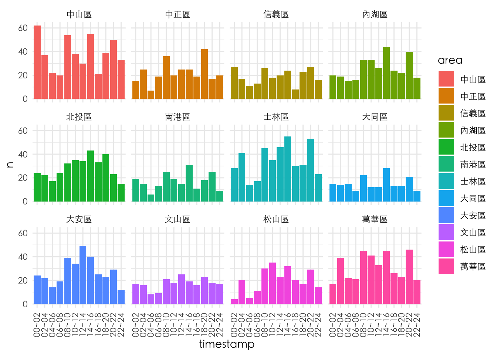

# (PART) DATA MANIPULATION {.unnumbered}

# From base R to dplyr {#base2dplyr}

**From base to tidyverse style**

相較於R base的較為傳統的R編程風格，tidyverse style的R programming具有以下幾個特點：

1.  基於tidy data理念：tidyverse style的R programming基於tidy data理念，即資料應該以規律的方式組織，以方便分析和視覺化。tidyverse style的R程式庫提供了一些工具和函數，用於處理和轉換tidy data格式的資料，如dplyr、tidyr等。

2.  使用管道操作符：tidyverse style的R programming通常使用管道操作符（%\>%），將資料通過多個函數連接起來，形成一個清晰和易於理解的資料處理流程。使用管道操作符可以簡化程式碼並提高程式的可讀性。

3.  強調函數庫的一致性：tidyverse style的R programming強調函數庫之間的一致性，即不同函數庫之間使用相似的函數名稱、參數名稱和返回值等，以方便使用者的學習和使用。

4.  使用簡潔的命名方式：tidyverse style的R programming通常使用簡潔和易於理解的變數和函數命名方式，例如使用動詞表示操作，使用名詞表示資料，以方便使用者理解程式碼的含義。

5.  提供高級的視覺化工具：tidyverse style的R programming提供了一些高級的視覺化工具，如ggplot2、gganimate等，可以幫助使用者更加輕鬆地進行資料視覺化和探索。

## dplyr

dplyr是一個tidyverse風格的R程式庫，用於對資料進行快速、一致、直觀的操作和轉換。dplyr提供了一些高效能的函數和工具，如`filter`、`select`、`mutate`、`group_by`和`summarize`等，用於對資料進行選擇、篩選、轉換、分組和摘要等操作。

以下是dplyr常用的函數：

1.  `filter`：用於選擇符合特定條件的資料列。

2.  `select`：用於選擇特定的欄位。

3.  `mutate`：用於新增或修改欄位。

4.  `group_by`：用於按照特定欄位進行分組。

5.  `summarize`：用於對分組後的資料進行摘要統計。

6.  `arrange`：用於按照欄位的特定順序進行排序。

dplyr具有以下優點：

1.  簡潔而直觀的語法：dplyr的函數名稱和語法都十分簡潔而直觀，易於使用和理解，尤其對於新手來說更加友好。

2.  高效的運行速度：dplyr的設計考慮了資料處理的效率，使用C++實現了部分函數，因此dplyr在處理大型資料集時運行速度較快。

3.  與tidyverse相容：dplyr與其他tidyverse程式庫，如ggplot2和tidyr，可以很好地相容，並且能夠與其他常用的R程式庫進行集成，提供更加全面和高效的資料分析和可視化工具。

## Taipie Theft Count (base to dplyr) {#tptheft_dplyr}


```r
library(tidyverse)
# options(stringsAsFactors = F) # default options in R ver.> 4.0
```

### Reading data


``` r
# Read by read_csv()
# Will raise error
# Error in make.names(x) : invalid multibyte string at '<bd>s<b8><b9>'
# df <- read_csv("data/tp_theft.csv")

# read_csv() with locale = locale(encoding = "Big5")
library(readr)
# df <- read.csv("data/臺北市住宅竊盜點位資訊-UTF8-BOM.csv", fileEncoding = "Big5")
df <- read_csv("data/臺北市住宅竊盜點位資訊-UTF8-BOM.csv", locale = locale(encoding = "Big5"))
head(df) 
```

``` output
## # A tibble: 6 × 5
##    編號 案類     發生日期 發生時段 發生地點                                   
##   <dbl> <chr>       <dbl> <chr>    <chr>                                      
## 1     1 住宅竊盜  1030623 08~10    臺北市中正區廈門街91~120號                 
## 2     2 住宅竊盜  1040101 00~02    臺北市文山區萬美里萬寧街1~30號             
## 3     3 住宅竊盜  1040101 00~02    臺北市信義區富台里忠孝東路5段295巷6弄1~30號
## 4     4 住宅竊盜  1040101 06~08    臺北市中山區新生北路1段91~120號            
## 5     5 住宅竊盜  1040101 10~12    臺北市文山區明興里興隆路4段1~30號          
## 6     6 住宅竊盜  1040102 00~02    臺北市士林區天福里1鄰忠誠路2段130巷1~30號
```

### Cleaning data I

-   Renaming variables by `select()`
-   Generating variable year by `mutate()`
-   Generating variable month by `mutate()`
-   Retrieving area by `mutate()`

#### (1) Without pipeline I


``` r
df1 <- select(df, id = 編號, cat = 案類, date = `發生日期`, timestamp = `發生時段`, location = `發生地點`)

df2 <- mutate(df1, year = date %/% 10000)
df3 <- mutate(df2, month = date %/% 100 %% 100)
df4 <- mutate(df3, area = str_sub(location, 4, 6))
df_selected <- mutate(df4, county = str_sub(location, 1, 3))
```

#### (2) Without pipeline II


``` r
library(stringr)

df_selected <- select(df, id = 編號, cat = 案類, date = `發生日期`, timestamp = `發生時段`, location = `發生地點`)

df_selected <- mutate(df_selected, year = date %/% 10000)
df_selected <- mutate(df_selected, month = date %/% 100 %% 100)
df_selected <- mutate(df_selected, area = str_sub(location, 4, 6))
df_selected <- mutate(df_selected, county = str_sub(location, 1, 3))
```

#### (3) With pipeline


``` r
library(stringr)
df_selected <- df %>%
    select(id = 編號, 
           cat = 案類, 
           date = `發生日期`, 
           timestamp = `發生時段`, 
           location = `發生地點`) %>%
    mutate(year = date %/% 10000) %>%
    mutate(month = date %/% 100 %% 100) %>%
    mutate(area = str_sub(location, 4, 6)) %>%
    mutate(county = str_sub(location, 1, 3))
```

### Cleaning data II

-   Filtering out irrelevant data records


``` r
# readr::guess_encoding("data/tp_theft.csv")
df_filtered <- df_selected %>%
  filter(county == "臺北市") %>%
  filter(year >= 104) %>%
  filter(!county %in% c("中和市", "板橋市")) %>%
  filter(!timestamp %in% c("01~03","03~05", "05~07", "09~11", "11~13", "11~03", "12~15", "15~17", "15~18", "17~19", "18~21", "19~21", "21~23", "21~24", "23~01"))
```

### Long to wide table

-   `count()` two variables
-   `pivot_wider()` spread one variable as columns to wide form


``` r
# count() then pivot_wider()
df_wide <- df_filtered %>% 
  count(timestamp, area) %>%
  pivot_wider(names_from = area, values_from = n, values_fill = 0)

??pivot_wider
```


``` r
df_long <- df_wide %>%
  pivot_longer(cols = 2:ncol(.), names_to = "area", values_to = "n")
```

### Plot with long table


``` r
df_filtered %>%
  count(timestamp, area) %>%
  ggplot() + 
  aes(x = timestamp, y = n, fill = area) + 
  geom_col(position = "dodge") + 
  facet_wrap(. ~ area) +
  # facet_wrap(. ~ area, nrow=length(unique(df_filtered$area))) +
  # facet_grid(. ~ area) +
  theme_minimal() +
  theme(
    text = element_text(family = "Heiti TC Light"),  # Apply font to all text
    axis.title = element_text(family = "Heiti TC Light"),  # X and Y axis labels
    axis.text = element_text(family = "Heiti TC Light"),   # X and Y axis values
    legend.text = element_text(family = "Heiti TC Light"), # Legend text
    legend.title = element_text(family = "Heiti TC Light"), # Legend title
    axis.text.x = element_text(angle = 90, hjust = 1, vjust = 0.5)
  )
```



### Clean version


``` r
library(readr)
library(tidyverse)

df <- read_csv("data/臺北市住宅竊盜點位資訊-UTF8-BOM.csv", locale = locale(encoding = "Big5"))

df_selected <- df %>%
    select(id = 編號, 
           cat = 案類,
           date = `發生日期`, 
           timestamp = `發生時段`, 
           location = `發生地點`) %>%
    mutate(year = date %/% 10000) %>%
    mutate(month = date %/% 100 %% 100) %>%
    mutate(area = stringr::str_sub(location, 4, 6)) %>%
    mutate(county = stringr::str_sub(location, 1, 3))

df_filtered <- df_selected %>%
  filter(county == "臺北市") %>%
  filter(year >= 104) %>%
  filter(!area %in% c("中和市", "板橋市")) %>%
  filter(!timestamp %in% c("01~03","03~05", "05~07", "09~11", "11~13", "11~03", "12~15", "15~17", "15~18", "17~19", "18~21", "19~21", "21~23", "21~24", "23~01"))

df_filtered %>%
  count(timestamp, area) %>%
  ggplot() + 
  aes(x = timestamp, y = n, fill = area) + 
  geom_col(position = "dodge") + 
  facet_wrap(. ~ area) +
  # facet_wrap(. ~ area, nrow=length(unique(df_filtered$area))) +
  # facet_grid(. ~ area) +
  theme_minimal() +
  theme(
    text = element_text(family = "Heiti TC Light"),  # Apply font to all text
    axis.title = element_text(family = "Heiti TC Light"),  # X and Y axis labels
    axis.text = element_text(family = "Heiti TC Light"),   # X and Y axis values
    legend.text = element_text(family = "Heiti TC Light"), # Legend text
    legend.title = element_text(family = "Heiti TC Light"), # Legend title
    axis.text.x = element_text(angle = 90, hjust = 1, vjust = 0.5)
  )
```


