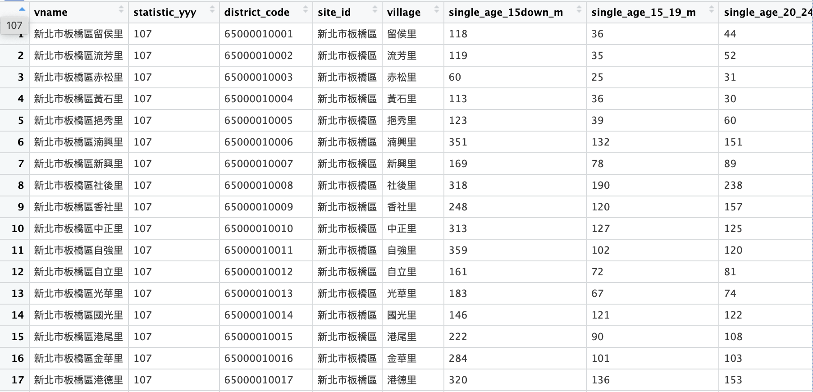
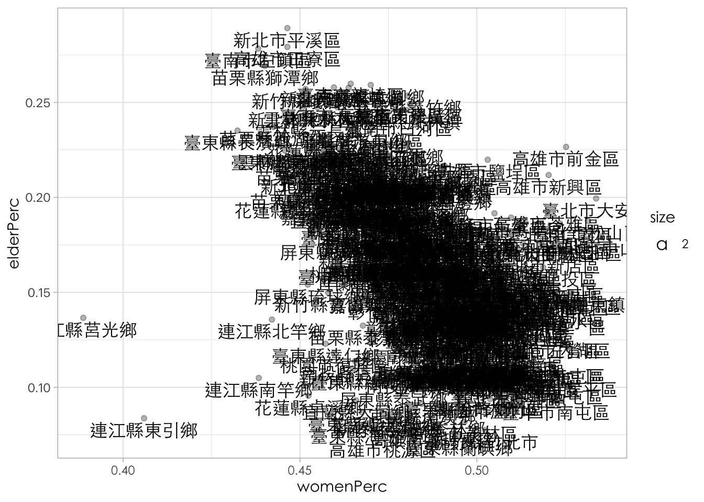
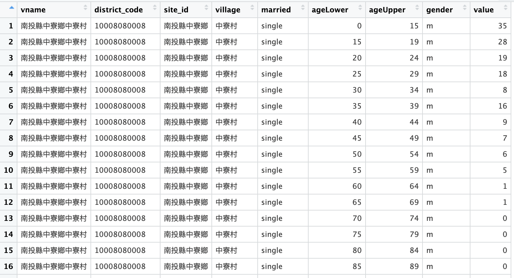

# Data manipultaiton: Join data {#joindata}

在資料處理與分析領域中，我們常常需要合併不同來源的資料，例如合併公投資料和內政部的人口統計資料、例如合併健保資料和長照資料、家戶資料、財稅局的所得資料等。這種合併資料的操作的語法源生於資料庫管理系統，而其中一種常見的操作就是使用不同類型的 `join` 來合併資料表。在資料庫中，當我們需要結合兩個或多個資料表時，我們通常會使用像是 `left_join()`、`right_join()`、`inner_join()` 和 `full_join()` 等不同類型的 `join` 操作。這些 `join` 操作可以根據指定的欄位值將兩個資料表中的資料按照不同的方式進行合併，以滿足具體的分析需求。

## An Example: Joining Two Data Frames {#simple}

以下為用來解釋 join 的簡單範例。其中 **`posts`** 有 **`pid`**（貼文編號）和 **`pcontent`**（貼文內容）兩個欄位；而 **`comments`** 包含了留言的資訊，有 **`pid`**（所屬的貼文編號）和 **`ccontent`**（留言內容）兩個欄位。


``` r
posts <- tibble(
  pid = c("p01", "p02", "p03"),
  pcontent = c("貼文p01內容", "貼文p02內容", "貼文p03內容")
)
comments <- tibble(
  pid = c("p02", "p02", "p03", "p01"),
  ccontent = c("留言01 to p02", "留言02 to p02", "留言03 to p03", "留言04 to p01")
)
posts
```

``` output
## # A tibble: 3 × 2
##   pid   pcontent   
##   <chr> <chr>      
## 1 p01   貼文p01內容
## 2 p02   貼文p02內容
## 3 p03   貼文p03內容
```

``` r
comments
```

``` output
## # A tibble: 4 × 2
##   pid   ccontent     
##   <chr> <chr>        
## 1 p02   留言01 to p02
## 2 p02   留言02 to p02
## 3 p03   留言03 to p03
## 4 p01   留言04 to p01
```

### `left_join()` & `right_join()`

-   `left_join()`會將兩個表格中的資料以左邊表格為主，並將右邊表格中符合左邊表格的資料進行合併。如果右邊表格中沒有符合的資料，則以 `NA`值填充。 在下面的範例中，我們將`posts`作為左表，`comments`作為右表，以`pid`欄位為連接依據，所以會返回`posts`表格中的所有資料，並將符合的`comments`資料合併進來。
-   `right_join()`與`left_join()`相反，它將兩個表格中的資料以右表為主，並將左邊表格中符合右表的資料進行合併。如果左表中沒有符合的資料，則以`NA`值填充。


```r
left_join(posts, comments)
```

```{.output}
## # A tibble: 3 × 3
##   pid   pcontent ccontent 
##   <chr> <chr>    <chr>    
## 1 p01   post01   <NA>     
## 2 p02   post02   comment01
## 3 p03   post03   comment02
```

```r
right_join(posts, comments)
```

```{.output}
## # A tibble: 3 × 3
##   pid   pcontent ccontent 
##   <chr> <chr>    <chr>    
## 1 p02   post02   comment01
## 2 p03   post03   comment02
## 3 p04   <NA>     comment03
```

```r
right_join(comments, posts)
```

```{.output}
## # A tibble: 3 × 3
##   pid   ccontent  pcontent
##   <chr> <chr>     <chr>   
## 1 p02   comment01 post02  
## 2 p03   comment02 post03  
## 3 p01   <NA>      post01
```

### `inner_join()` and `full_join()`

-   `inner_join()`會返回兩個表格中共同符合連接條件的資料。換句話說，它會保留左右兩表中都有對應資料的列。如果左右表格中有任一邊缺少符合的資料，則該資料將不會出現在結果中。
-   `full_join()`會返回兩個表格中所有的資料，並將缺失的值以`NA`填充。如果兩表中有共同符合的資料，則會將它們合併在一起；如果某個表格中有但另一個表格中沒有的資料，則會將缺失的資料補上`NA`。


```r
inner_join(posts, comments)
```

```{.output}
## # A tibble: 2 × 3
##   pid   pcontent ccontent 
##   <chr> <chr>    <chr>    
## 1 p02   post02   comment01
## 2 p03   post03   comment02
```

```r
full_join(posts, comments)
```

```{.output}
## # A tibble: 4 × 3
##   pid   pcontent ccontent 
##   <chr> <chr>    <chr>    
## 1 p01   post01   <NA>     
## 2 p02   post02   comment01
## 3 p03   post03   comment02
## 4 p04   <NA>     comment03
```

### `join()` by different keys

以下是一個新的例子，假設`posts`與`comments`兩張表，沒有共同的變項，但你知道`posts`表的變項`postid`和`comments`表的變項`pid`所指的是共同的概念，也就是貼文的id，只是在不同的表上他們所用的變項名稱不同。

我們將 **`posts`** 作為左表，**`comments`** 作為右表，並使用 **`postid`** 和 **`pid`** 欄位進行連接。由於我們經由觀察知道左邊表格中的 **`postid`** 和右邊表格中的 **`pid`** 有對應關係，所以它們會根據這個關係進行連接，語法為`by=c("postid"="pid")`，指定左表的`postid`和右表的`pid`相對應。


``` r
posts <- tibble(postid = c("p01", "p02", "p03"), pcontent = c("post01", "post02", "post03"))
comments <- tibble(pid = c("p02", "p03", "p04"), ccontent = c("comment01", "comment02", "comment03"))
result <- left_join(posts, comments, by = c("postid" = "pid"))
```

## 1. 案例說明-公投案與人口資料

2018年中華民國全國性公民投票共有10個提案，其中6個提案獲得通過。通過的提案包括反空污、反燃煤發電、反日本核災地區食品進口、民法婚姻限定一男一女、國中小不實施同志教育、非民法保障同性共同生活，以及廢止電業法非核家園條文。未通過的提案有2020東京奧運台灣正名、以民法保障同性婚姻和國中小性別平等教育明定入法。此次公投與九合一地方選舉同時舉行，並創下中華民國歷史上公民投票案數最多的一次。（請見[中華民國全國性公民投票 - 維基百科，自由的百科全書](https://zh.wikipedia.org/zh-tw/%E4%B8%AD%E8%8F%AF%E6%B0%91%E5%9C%8B%E5%85%A8%E5%9C%8B%E6%80%A7%E5%85%AC%E6%B0%91%E6%8A%95%E7%A5%A8)）。

### 1.1 資料來源

-   [15歲以上現住人口按性別、年齡、婚姻狀況及教育程度分 \| 政府資料開放平臺 (data.gov.tw)](https://data.gov.tw/dataset/32944)
-   [15歲以上現住人口按性別、年齡、婚姻狀況及教育程度分(含同婚) ｜ 政府資料開放平臺](https://data.gov.tw/dataset/117988) （118後）
-   [ywchiu/referendum: 2018 公投案資料集](https://github.com/ywchiu/referendum) 網路上有一些已經整理好的公投資料，或者要到中選會下載。

### 1.2 處理策略

在這個案例中，合併公投結果與人口統計資料的策略主要是基於兩個資料集之間的共同鍵值（`site_id`），將兩個資料集根據相同的地理單位進行合併。首先，讀取並清理內政部的總人口統計資料，將其轉換為 tidy 型態後，透過 `group_by()` 和 `summarise()` 來匯總每個鄉鎮市區（或村里）的基本人口資料。接著，讀取公投結果資料，並創建一個名為 `site_id` 的變項，使其與人口統計資料中的相對應變項對應。

在合併過程中，為了確保兩筆資料能正確匹配，需處理資料中的空白字符問題。例如，公投資料中的某些地區名稱可能會與人口資料中的地區名稱存在全形空白字符的差異，因此需要使用 `str_replace()` 函數將這些空白字符去除，保證兩者可以順利合併。使用 `left_join()` 函數，將公投結果資料中的相關欄位（如同意票數、不同意票數等）根據 `site_id` 合併至人口統計資料中，從而生成一個包含所有關鍵人口指標和公投結果的完整資料集。

合併後，我們可以計算出每個鄉鎮市區的同意票率（`agreeRate`）與結婚人口比例（`marriedPerc`）等指標，並使用視覺化工具進行相關性分析，探討公投結果與人口結構之間的潛在關聯。這樣的資料合併方式不僅有助於整合多來源資料，也為後續深入的分析提供了可靠的基礎。

共包含以下步驟：

1.  建立各鄉鎮市區的老年人口比例（作為老化指數的代表），或建立各鄉鎮市區的年齡中位數。
2.  讀取所有（某一）公投案的結果（以第十案為例）
3.  合併鄉鎮市區層級的年齡指數和公投結果
4.  視覺化年齡與公投結果間的相關性

## 2. 讀取內政部人口統計資料 {#moi}

首先，使用 `slice(-1)` 函數來去除第一行的中文欄位名稱。接著，縣市鄉鎮市區（`site_id`）和村里（`village`）原本是兩個分開的變項，然而，由於不同的鄉鎮市可能會有相同的村里名稱，因此需要將 `site_id` 與 `village` 這兩個變項結合，形成一個完整的村里名稱 `vname`。

在此過程中，我額外加入了一行程式碼，使得 `vname` 可以排在變項欄位的前面。這可以透過使用 `select()` 函數來達成此目的。由於我後續需要保留其他變項欄位，為了不改變它們的位置，可以使用 `everything()` 函數來將剩餘的變項欄位移到後面。因此，重排變項欄位的完整程式碼為 `select(vname, everything())`。


``` r
raw <- read_csv("data/opendata107Y030.csv") %>%
  slice(-1) %>%
  mutate(vname = str_c(site_id, village)) %>%
  select(vname, everything())

raw %>% head()
```

``` output
## # A tibble: 6 × 157
##   vname          statistic_yyy district_code site_id village single_age_15down_m
##   <chr>          <chr>         <chr>         <chr>   <chr>   <chr>              
## 1 新北市板橋區留侯里…… 107           65000010001   新北市板橋區… 留侯里  118                
## 2 新北市板橋區流芳里…… 107           65000010002   新北市板橋區… 流芳里  119                
## 3 新北市板橋區赤松里…… 107           65000010003   新北市板橋區… 赤松里  60                 
## 4 新北市板橋區黃石里…… 107           65000010004   新北市板橋區… 黃石里  113                
## 5 新北市板橋區挹秀里…… 107           65000010005   新北市板橋區… 挹秀里  123                
## 6 新北市板橋區湳興里…… 107           65000010006   新北市板橋區… 湳興里  351                
## # ℹ 151 more variables: single_age_15_19_m <chr>, single_age_20_24_m <chr>,
## #   single_age_25_29_m <chr>, single_age_30_34_m <chr>,
## #   single_age_35_39_m <chr>, single_age_40_44_m <chr>,
## #   single_age_45_49_m <chr>, single_age_50_54_m <chr>,
## #   single_age_55_59_m <chr>, single_age_60_64_m <chr>,
## #   single_age_65_69_m <chr>, single_age_70_74_m <chr>,
## #   single_age_75_79_m <chr>, single_age_80_84_m <chr>, …
```

``` r
# raw %>% glimpse()
```

## 3. 觀察資料

在資料分析中，我們常見兩種資料型態：**long-table（長格式表格）** 和 **wide-table（寬格式表格）**。這兩種格式在統計分析中的應用有所不同。

**Wide-table（寬格式表格）**，也稱為二維表格型態，將資料展開成多個變項的組合。每一列不僅包含一個變項，還可能包含不同類別或組合的變數，如年齡層、性別、婚姻狀況等，這些組合會在不同的欄位中呈現。這種資料格式便於呈現各種不同組合的數據，但不適合進行直接的統計分析。例如，在內政部的開放資料「15歲以上現住人口按性別、年齡、婚姻狀況及教育程度分」中，每一列的資料通常會包含多個年齡層（如 15-19 歲、20-24 歲等）、性別（男性、女性）以及婚姻狀況（如已婚、單身等）等組合，並以不同的欄位呈現。這樣的資料結構適合展示和理解各種分類組合，但對於統計分析來說，則需要進行轉換。

**Long-table（長格式表格）**，也稱為統計型態，指的是將資料轉換為每一列代表一個觀察單位（如一個年齡層、一個性別、一個婚姻狀況的組合），而每一個變項（例如年齡、性別、婚姻狀況）則是單獨的變項欄位。在長格式資料中，數據以單一變項的形式呈現，每一列只包含一個具體的變項值。當內政部資料從寬格式轉換為長格式時，我們會將原本在同一欄位中的多個年齡層、性別和婚姻狀況組合，拆分成獨立的變項，這樣的資料結構便於進行統計計算與後續分析。

**寬格式表格（wide-table）雖然適合展示多維度資料，便於閱讀和理解，但在統計分析中並不如長格式表格（long-table）**方便，因為長格式資料將每個變項獨立處理，有助於進行統計和視覺化分析。以下為內政部資料Wide-table的原型。



## 4. 彙整列數據為新的變項：使用Rowwise()

觀察`raw`中的資料，你可以看見他是一個寬表格，但每一列已經是一個完整的觀察單位（此範例為村里）。過去我們可能會需要把資料轉為長表格後，再用 `group()`搭配 `summarize()`來做群組彙整運算。但這個例子剛好很特別，我們要形成的指標，只要把某幾個欄（變項）給加總起來就好。例如，把所有變項名稱中有包含60歲以上的資料欄的列值給加起來。而這產生了一個問題，**現在我有數十個變項的列值想要相加（就像這個例子），要怎麼辦**？

如果我們處理的是一個簡單的範例如 `df <- tibble( a = c(1, 2, 3), b = c(4, 5, 6) )`。我想建立a與b兩個變項的加總，我實際上只要做 `mutate(df, s = a + b)`。那可不可以寫成 `mutate(df, s = sum(a, b))`？你可以試試看，結果並非你想像的樣子。他會是把所有`a`與`b`的值加總起來的結果。顯然單用`sum()`無法得到我們心目中想要的結果。

這時候，可以用`rowwise()`來達成這樣的目的，此時所有的計算均會以`rowwise()`的方式來進行運算。如果你後續還要處理很多不同的運算的話，務必記得最後也要加一個`ungroup()`來回到一般的tibble操作。


``` r
df <- tibble(a = c(1, 2, 3), b = c(4, 5, 6))
mutate(df, s = a + b)
```

``` output
## # A tibble: 3 × 3
##       a     b     s
##   <dbl> <dbl> <dbl>
## 1     1     4     5
## 2     2     5     7
## 3     3     6     9
```

``` r
mutate(df, s = sum(a, b)) # %>% View
```

``` output
## # A tibble: 3 × 3
##       a     b     s
##   <dbl> <dbl> <dbl>
## 1     1     4    21
## 2     2     5    21
## 3     3     6    21
```

``` r
df %>%
  rowwise() %>%
  mutate(s = sum(a, b)) %>%
  ungroup() # %>% View
```

``` output
## # A tibble: 3 × 3
##       a     b     s
##   <dbl> <dbl> <dbl>
## 1     1     4     5
## 2     2     5     7
## 3     3     6     9
```

除此之外，我們還可以用`c_across()`來選取變數名稱符合條件的變項。`c_across()` 是 `dplyr` 中**專門為 `rowwise()` 設計的語法**，用來在 `mutate()` 中**選取多個欄位、當成一個向量來處理**，例如你要取平均、加總、標準差等。例如你有可能可以寫出`mutate(mean_val = mean(c_across(a:c))) %>%`或`mutate(mean_val = mean(c_across(3:10))) %>%`等的程式碼。

-   在以下程式碼中，還用到了`mutate_at(vars(6:157), as.numeric) %>%` 這個很有用的寫法，可以一次把第6到第157個變項通通轉為數值。
-   `rowwise()`是為了能夠把每個變項當成向量，然後依照列來彙整數據。
-   `c_across()`是為了可以操作多個變項。
-   `matches()`是為了挑選名稱符合條件的變項。


``` r
village_stat <- raw %>%
  mutate_at(vars(6:157), as.numeric) %>%
  replace(is.na(.), 0) %>%
  rowwise() %>%
  mutate(legalPopulation = sum(c_across(6:157))) %>%
  mutate(marriedSum = sum(c_across(matches("widowed|divorced|married")), na.rm = T)) %>%
  mutate(elderSum = sum(c_across(matches("65|70|75|80|85|90|95|100")), na.rm = T)) %>%
  mutate(womenSum = sum(c_across(matches("_f")), na.rm = T)) %>%
  select(vname, site_id, village, legalPopulation, marriedSum, elderSum, womenSum) %>%
  ungroup()
```

### 補充：`c_across()`的應用時機

| 需求                       | 做法                                   |
|----------------------------|----------------------------------------|
| 每列平均                   | `mutate(mean = mean(c_across(a:c)))`   |
| 每列標準差                 | `mutate(sd = sd(c_across(a:c)))`       |
| 每列最大值                 | `mutate(max_val = max(c_across(a:c)))` |
| 依欄位範圍條件過濾（進階） | `filter(any(c_across(a:c) > 10))`      |

## 5. 將村里指標匯總為鄉鎮市區指標 {#moi_town_groupby}

剛剛是根據村里（village）來建立指標，現在要根據鄉鎮市區來建立指標。走過前方的邏輯後，我們只需要把原本用來做`group_by()`的村里變項`vname`改為鄉鎮市區的變項`site_id`，就可以完成這件事，其他都一樣，你發現沒？

不過這邊我要多做一件事。因為三民區和鳳山區兩個區非常的大（我猜），所以內政資料中的鄉鎮市區資料有分「三民一」、「三民二」、「鳳山一」、「鳳山二」。我們只要在彙整資料前，將`site_id`的這四類值取代好，便可以在鄉鎮市區的指標中一併彙整。以下我一共彙整出四種資料，分別為該區人口數（`legalPopulation`）、老年人口數（`elderSum`）、曾婚人口數（`marriedSum`）、女性人口數（`womenSum`）。不難想像接下來可以計算出各鄉鎮市區的老年人口比例、曾婚比例、女性比例等。


``` r
town_stat <- village_stat %>%
  # mutate(site_id = str_sub(vname, 1, 6)) %>%
  mutate(site_id = str_replace(site_id, "三民一|三民二", "三民區")) %>%
  mutate(site_id = str_replace(site_id, "鳳山一|鳳山二", "鳳山區")) %>%
  group_by(site_id) %>%
  summarize(
    legalPopulation = sum(legalPopulation),
    elderSum = sum(elderSum),
    marriedSum = sum(marriedSum),
    womenSum = sum(womenSum)
  ) %>%
  ungroup()
```

## 6. 視覺化測試（老年人口數 x 曾婚人口數） {#moi_visual_popul}


``` r
th <-
  theme(
    title = element_text(family = "Heiti TC Light"),
    text = element_text(family = "Heiti TC Light"),
    axis.text.y = element_text(family = "PingFang TC"),
    axis.text.x = element_text(family = "Heiti TC Light"),
    legend.text = element_text(family = "Heiti TC Light"),
    plot.title = element_text(family = "Heiti TC Light")
  )

town_stat %>%
  mutate(marriedPerc = marriedSum / legalPopulation) %>%
  mutate(womenPerc = womenSum / legalPopulation) %>%
  mutate(elderPerc = elderSum / legalPopulation) %>%
  ggplot() +
  aes(womenPerc, elderPerc) +
  geom_point(alpha = 0.3) +
  geom_text(aes(label = site_id, vjust = 1.3, size = 2), family = "Heiti TC Light") +
  theme_light() +
  th
```



``` r
# geom_jitter(alpha = 0.3)
```

## 7. 合併公投資料 {#referendum}

### 7.1. 讀取公投資料

首先，先讀取資料並重新命名每個變項。由於我們要連結公投資料和前面的內政部人口統計資料，所以要注意兩筆資料間是否有共通的key（資料庫稱為鍵值）。`town_stat`的是以`site_id`鄉鎮市區名為主鍵，所以公投資料這邊也產生一個同名的鄉鎮市區變項`site_id`。


``` r
ref10 <- read_csv("data/ref10.csv") %>%
  select(
    county = 縣市, town = 鄉鎮市區,
    agree = 同意票數, disagree = 不同意票數,
    legalVote = 有效票數, illegalVote = 無效票數,
    vote = 投票數, legalPopulation = 投票權人數
  ) %>%
  mutate(site_id = str_c(county, town)) %>%
  drop_na(site_id)

names(ref10)
```

``` output
## [1] "county"          "town"            "agree"           "disagree"       
## [5] "legalVote"       "illegalVote"     "vote"            "legalPopulation"
## [9] "site_id"
```

合併資料測試，注意，由於兩邊都有`legalPopulation`，所以`town_stat`中的`legalPopulation`增生為`legalPopulation.x`，而`ref10`中的`legalPopulation`則重新命名為`legalPopulation.y`。


``` r
town_stat %>%
  left_join(ref10, by = "site_id") %>%
  head()
```

``` output
## # A tibble: 6 × 13
##   site_id      legalPopulation.x elderSum marriedSum womenSum county town  agree
##   <chr>                    <dbl>    <dbl>      <dbl>    <dbl> <chr>  <chr> <dbl>
## 1 南投縣中寮鄉             14680     3272       9556     6711 南投縣 中寮鄉……  5748
## 2 南投縣仁愛鄉             15969     1713       9099     7724 南投縣 仁愛鄉……  5702
## 3 南投縣信義鄉             16230     1847       9059     7556 南投縣 信義鄉……  6891
## 4 南投縣南投市             99519    15855      57054    49714 南投縣 南投市…… 37547
## 5 南投縣名間鄉             38265     7106      23384    18064 南投縣 名間鄉…… 14533
## 6 南投縣國姓鄉             18629     3744      11831     8571 南投縣 國姓鄉……  7089
## # ℹ 5 more variables: disagree <dbl>, legalVote <dbl>, illegalVote <dbl>,
## #   vote <dbl>, legalPopulation.y <dbl>
```

### 7.2. 合併公投資料並視覺化 {#moi_join_ref}

由於人口統計資料中的鄉鎮市區若只有兩個字如「東區」中間有一全形空白「東　區」，但公投資料中並沒有這樣的空白，所以為了兩者要能夠正確合併，需要先做好取代。可以逐一取代，或者，直接取代掉該全形空白為空字串即可。


``` r
town_stat %>%
  mutate(site_id = str_replace(site_id, "　", "")) %>%
  left_join(ref10, by = "site_id") %>%
  mutate(
    agreeRate = agree / legalVote,
    marriedPerc = marriedSum / legalPopulation.x,
    elderPerc = elderSum / legalPopulation.x
  ) %>%
  ggplot() +
  aes(agreeRate, elderPerc) +
  geom_point(alpha = 0.5, color = "royalblue") +
  geom_text(aes(label = site_id, vjust = 1.3, size = 2), family = "Heiti TC Light") +
  theme_light()
```


## 8. 補充：不用`rowwise()`的做法

### **8.1. 寬表轉長表**

接下來，我要用 `pivot_longer()` 把表格型態的資料轉為 `tidy` 型態，也就是Long-table的型態。相對於`pivot_wider()`把某一變項展開成欄方向的變項，`pivot_longer()`函式是用來收合被展開的變項。針對這個資料，我要將變項欄（`single_age_15down_m`、`single_age_15_19_m`等）轉為單一變項（命名為 `key` ），再把其所對應到的資料值，也轉為單一變項（命名為 `value`）。

`pivot_longer()` 共有三個參數：

1.  `cols`用來指出要把哪些變項收合回來，這個例子是為`6:ncol(.)`，`ncol(.)` 是取得資料框中的欄位數量，即最後一個欄位的索引。 `.` 是指從pipe符號 `%>%` 傳遞過來的data.frame。因此，`ncol(.)` 用來取得資料框的總欄位數，也就是該資料框中的最後一個變項的欄位位置。`cols = 6:ncol(.)` 表示選擇從第6個欄位到最後一個欄位的範圍，並將這些欄位進行轉換。
2.  `names_to`是用來指出收合回來的變項要命名為什麼變項；
3.  `values_to`用來指出對應到的值要命名為什麼變項。


``` r
tidy_data <- raw %>%
  pivot_longer(names_to = "key", values_to = "value", cols = 6:ncol(.))
```

`pivot_longer()`後資料列從7760增加至1,179,520列。

### 8.2. 切分變項

由於每一列恰好是一種婚姻狀態、一個年齡層和一個性別，所以，我們可以把`key`中的婚姻狀態、年齡層和性別切割出來做為變數。觀察`key`欄位發現其格式有一些規律性，主要是婚姻狀態_年齡下界_年齡上界_性別的形式。標準的範例如`married_15_10_m或widowed_25_29_f`，但有一些並非這種形式，必須要先做一點前處理。例如：

-   `single_age_15_19_m`：其中`single_age`之間多了一個底線，所以把`single_age`取代為`single`就好。

-   `married_15down_m`：因為是`15down`少了一個底線，所以取代為`0_15`。

-   `married_100up_f`：因為`100up`少了一個底線，所以取代為`100_110`。

取代後，現在應該每個用底線切分開的變項是一致的。再使用`tidyr::separate()`函式將`key`欄位切成四個變項，分別為`married`、`ageLower`、`ageUpper`、`gender`。

-   `separate()`有一個參數是`remove=T`（預設值），意思是說，當把`key`變項切割為四個變項後，預設把key變項給丟棄；但如果未來你還會用到`key`變項的話，你可以把`remove`改為`FALSE`，代表切割完後，還保留`key`變項。
-   `tidyr::separate()`：Given either regular expression or a vector of character positions, separate() turns a single character column into multiple columns.

此時我清理出來的資料概況如下：



最後就剩零星的操作，包含轉換資料為數值型態、或者你也可以在這裡建立新的指標（例如年齡平均）。最後加上一個`arrange(vname)`讓他按照村里的全名排序。


``` r
tidy_data <- raw %>%
  pivot_longer(names_to = "key", values_to = "value", cols = 6:ncol(.)) %>%
  mutate(key = str_replace(key, "_age", "")) %>%
  mutate(key = str_replace(key, "100up", "100_110")) %>%
  mutate(key = str_replace(key, "15down", "0_15")) %>%
  separate(key, c("married", "ageLower", "ageUpper", "gender")) %>%
  mutate(
    ageLower = as.numeric(ageLower),
    # age = str(ageLower, ageUpper),
    ageUpper = as.numeric(ageUpper),
    value = as.numeric(value)
  ) %>%
  select(-statistic_yyy) %>%
  arrange(vname)
```

### 8.3. 使用`group_by()`建立村里指標 {#moi_vil_groupby}

將資料轉換為tidy型態後，接下來要做的事情是建立村里、鄉鎮市區、縣市的分級指標。針對每個村里，我希望計算出總人口數`people`（原本依據年齡與性別、婚姻情形分割）、老年人總數`elderSum`、曾結婚人口總數`marriedSum`。之後再分別除以該村里的總人口數`people`，老年人的人口比例`elderPerc`以及結婚的人口比例`marriedPerc`。

因為一個村里的資料會根據不同性別、不同婚姻情形、不同年齡層被切割為不同的資料列，共2X4X19個資料列。因此，如果我想知道一個村里的總人口數或相關統計資料，就不需彙整這些資料列。`dplyr`有非常強大的`group_by()`可以根據群組來進行運算，我用村里代號（`district_code`）來做群組運算，所以是`group_by(district_code)`或用我們所產生的`vname`作為群組基準來運算`group_by(vname)`。

語法上，通常`group_by()`之後經常會跟著`summarise()`，跟`mutate()`的語法有點像，都會產生新變數，但因為這邊用`group_by()`針對某個或某幾個變數做彙整，相當於`base`套件的`apply()`函式，因此會根據每個不同的群組做組內的數值彙整運算。比方說，在以下的程式碼中，我用`sum(num)`計算了該群組內的總人數，然後同樣累計了年齡大於等於65歲的總人數，以及婚姻狀態不為single的總人數。

簡單地說，相當於按照不同的村里（`district_code`）各別做`value`的加總（該村里的總人口數）、篩選出年齡65歲以上的人口組別進行加總、篩選出不是單身者的人口組別進行加總。之後會加一個`ungroup()`解開群組。

最後一行`left_join(raw %>% select(vname, site_id), by = "vname")`是由於`group_by()`後會讓其他變數消失（例如鄉鎮市區名`site_id`），所以我希望將原本資料`raw`中的`site_id`給併回來。我可以抽取出`raw`中的`vname`和`site_id`兩個變項，然後以`vname`為key，用`left_join()`將`site_id`給併回來。

筆記：當`group_by()`、`summarize()`後不參與的變項會消失，但可以透過`left_join()`的方式將原有的變項併回來。


``` r
village_stat <- tidy_data %>%
  filter(ageLower >= 20) %>%
  group_by(vname) %>%
  summarise(
    legalPopulation = sum(value),
    elderSum = sum(value[ageLower >= 65]),
    marriedSum = sum(value[married %in% c("married", "divorced", "widowed")]),
    womenSum = sum(value[gender == "f"])
  ) %>%
  ungroup() %>%
  left_join(raw %>% select(vname, site_id), by = "vname")
```

測試


