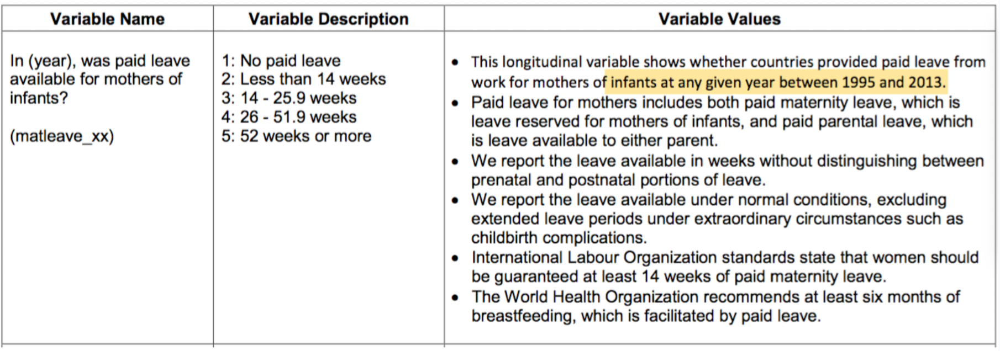

# Categorical Data Analysis {#categorical}


## Survey Analysis

國外不少媒體會用智庫或者學術單位所發佈的調查結果作為資料新聞素材，我們所曾經處理過的華盛頓郵報的產假支薪案例也是。以下為該案例資料的截圖。`matleave_95`代表1995年的資料，每個變數的數據1至5分別代表產假時給付薪水的月數區間共有五個區間。區間大小通常需要查看編碼簿來獲取定義。


這類資料由於採用數字（其實是Factor）來替代類別，通常隨著數據會釋出該調查的編碼簿（Code Book），這個案例的編碼（1至5）如下：



## The Case: Misinformation Perception

這個範例涵括了在做問卷分析時常用的處理步驟。最核心的步驟是將文字陳述的類別資料轉換為便於後續運算的`factor`或數值資料。如果類別數量過多的時候，在這個過程會順便進行重新分組。例如依照年齡組把填答者分為老年、中壯年、青少年、兒童四組。


```r
raw <- read_rds("data/tfc_survey.rds")
raw
```

```{.output}
## # A tibble: 1,216 × 6
##    Q7    Q8     QAParty      QASide       QA3   QA4               
##    <chr> <chr>  <chr>        <chr>        <chr> <chr>             
##  1 會    絕對會 民主進步黨   非常接近泛綠 25-29 研究所及以上      
##  2 會    絕對會 沒有政黨偏好 接近泛藍     35-39 研究所及以上      
##  3 不會  絕對會 沒有政黨偏好 接近泛綠     35-39 大專（專科與大學）
##  4 會    會     台灣民眾黨   接近泛綠     20-24 大專（專科與大學）
##  5 不會  不會   民主進步黨   非常接近泛綠 45-49 研究所及以上      
##  6 會    絕對會 沒有政黨偏好 非常接近泛藍 25-29 大專（專科與大學）
##  7 不會  絕對會 民主進步黨   接近泛綠     30-34 大專（專科與大學）
##  8 會    絕對會 台灣民眾黨   接近泛綠     20-24 大專（專科與大學）
##  9 會    絕對會 沒有政黨偏好 接近泛藍     20-24 大專（專科與大學）
## 10 會    會     民主進步黨   接近泛綠     55-59 高中、高職        
## # ℹ 1,206 more rows
```

## Factorizing data {#factorize}

通常問卷會分為兩種類型的資料，一種是人口統計用的基本資料（如性別、年齡組、教育程度）、另一種是問卷本身要問的題項。以下是常見的問卷型態，包含把年齡從20歲開始每五年作為一組，70歲以上則歸類為一組，共會有十一組。而教育程度則常分為五至六組，但在問卷設計的時候，通常會需要增加「拒答」的選項。如果問卷中包含政黨意識形態，就必須要決定要以黨派作為類別變項，或者以意識形態做順序尺度。以下即為一個順序尺度的案例，從「非常接近泛綠」到「非常接近泛藍」共五個等第，但另增「拒答」選項。


```r
dt <- raw %>%
  mutate(QA3 = ordered(QA3, levels=c("20-24", "25-29", "30-34", "35-39", 
                                     "40-44", "45-49", "50-54", "55-59", 
                                     "60-64", "65-69", "70及以上"))) %>%
  mutate(QA3_lv = ordered(QA3, 
                          levels=c("20-24", "25-29", "30-34", "35-39", 
                                   "40-44", "45-49", "50-54", "55-59", 
                                   "60-64", "65-69", "70及以上"),
                          labels = c("青年", "青年", "壯年", "壯年", 
                                     "壯年", "中年", "中年", "中年", 
                                     "中年", "老年", "老年"))) %>%
  mutate(QA4 = ordered(QA4, 
                       levels=c("拒答", "國小及以下", "初中、國中", 
                                "高中、高職", "大專（專科與大學）",
                                "研究所及以上"), 
                       labels=c("拒答", "國小以下", "國中", 
                                "高中職", "大專", "研究所以上"))) %>%
  mutate(QASide=ordered(QASide, 
                        exclude="拒答", 
                        levels=c("非常接近泛綠", "接近泛綠", 
                                 "都不接近", "接近泛藍", "非常接近泛藍")))
```

### factor-to-order {#factor2order}

在一開始清理資料的時候，會建議先把類別變數（通常是文字型態）轉為`factor`型態。常用的函式是用`mutate()`搭配`ordered()`來改變變數型態。`ordered()`會照類別順序來標定該`factor`所對應到的數字。可以用`as.integer()`將`factor`轉為整數後就可以看到各類別的順序。

```         
  mutate(QA3 = ordered(QA3, levels=c("20-24", "25-29", "30-34", "35-39", 
                                     "40-44", "45-49", "50-54", "55-59", 
                                     "60-64", "65-69", "70及以上"))) %>%
```


```r
dt$QA3[1:10]
```

```{.output}
##  [1] 25-29 35-39 35-39 20-24 45-49 25-29 30-34 20-24 20-24 55-59
## 11 Levels: 20-24 < 25-29 < 30-34 < 35-39 < 40-44 < 45-49 < 50-54 < ... < 70及以上
```

```r
as.integer(dt$QA3[1:10])
```

```{.output}
##  [1] 2 4 4 1 6 2 3 1 1 8
```

### Excluding {#excluding}

如果有某些類別變數的值（如「拒答」）不想被編入`factor`，可以在`reorder()`中加入`exclude`的參數指定不想被編入類別值。

```         
  mutate(QASide=ordered(QASide, 
                        exclude="拒答", 
                        levels=c("非常接近泛綠", "接近泛綠", 
                                 "都不接近", "接近泛藍", "非常接近泛藍")))
```


```r
dt$QASide[1:10]
```

```{.output}
##  [1] 非常接近泛綠 接近泛藍     接近泛綠     接近泛綠     非常接近泛綠
##  [6] 非常接近泛藍 接近泛綠     接近泛綠     接近泛藍     接近泛綠    
## Levels: 非常接近泛綠 < 接近泛綠 < 都不接近 < 接近泛藍 < 非常接近泛藍
```

```r
as.integer(dt$QASide[1:10])
```

```{.output}
##  [1] 1 4 2 2 1 5 2 2 4 2
```

### Grouping-up {#groupup}

如果有某些類別變數的類別過多，希望再次群組化為較少的組別，如重新群組各年齡層為青年、壯年、中年與老年四個尺度。此時除了`levels`參數外，可以另外加入`labels`的參數，指定每個類別變數值所要對應到的群組。以下為群組後的結果，仔細觀察剩下多少個尺度。

```         
  mutate(QA3_lv = ordered(QA3, 
                          levels=c("20-24", "25-29", "30-34", "35-39", 
                                   "40-44", "45-49", "50-54", "55-59", 
                                   "60-64", "65-69", "70及以上"),
                          labels = c("青年", "青年", "壯年", "壯年", 
                                     "壯年", "中年", "中年", "中年", 
                                     "中年", "老年", "老年"))) %>%
```


```r
dt$QA3[1:10]
```

```{.output}
##  [1] 25-29 35-39 35-39 20-24 45-49 25-29 30-34 20-24 20-24 55-59
## 11 Levels: 20-24 < 25-29 < 30-34 < 35-39 < 40-44 < 45-49 < 50-54 < ... < 70及以上
```

```r
as.integer(dt$QA3[1:10])
```

```{.output}
##  [1] 2 4 4 1 6 2 3 1 1 8
```

```r
dt$QA3_lv[1:10]
```

```{.output}
##  [1] 青年 壯年 壯年 青年 中年 青年 壯年 青年 青年 中年
## Levels: 青年 < 壯年 < 中年 < 老年
```

## Order-to-factor {#order2factor}

-   Q7 請問您會不會受到假消息影響？
-   Q8 請問您認為其他人會不會受到假消息的影響？

對於Q7、Q8的問題是詢問填答者認為自己或他人會不會受到假消息影響，並從「一點也不會」、「不會」、「會」到「絕對會」共分四個等第。Q7分別是「81, 446, 650, 39」、Q8分別是「5, 58, 803, 350」。相較於Q7，Q8的分佈略為左傾，亦即傾向於認為其他人較容易受影響。此時如果想要分析Q7和Q8間的關係，由於各有四個等第，其交叉分析表會有16個項目，相當難以分析。


```r
dt2 <- dt %>%
  mutate(Q7 = ordered(Q7, levels=c("一點也不會", "不會", "會", "絕對會"))) %>%
  mutate(Q8 = ordered(Q8, levels=c("一點也不會", "不會", "會", "絕對會"))) %>%
  mutate(Q7_3rd = as.numeric(Q8)-as.numeric(Q7)) %>%
  mutate(Q7_3rd_lv = ifelse(Q7 %in% c("一點也不會", "不會") & Q8 %in% c("會", "絕對會"), "高", "低")) %>%
  mutate(Q7_3rd_lv = ordered(Q7_3rd_lv, levels=c("低", "高")))
```

這時候一種策略是把這兩題視為順序尺度變數，然後把兩題的分數相減。相減後的分數從「-1, 0, 1, 2, 3」各有「12, 482, 600, 103, 19」，不難猜到會是一個較為集中的分佈，後續僅能當作順序尺度或連續變項來分析，不適合找一個閾值轉類別變項。

另一種策略是，分別先把Q7與Q8的「一點也不會」和「不會」群組為「不會」、再把「會」與「絕對會」群組為「會」，這樣Q7與Q8的交叉分析表會變成2X2的分析表，雖然群組數量比較少，但別忘記Q7的填答結果集中在會與不會、而Q8為一個較為偏右的分佈，集中在「會」和「絕對會」。Q8勢必會造成比例不均的分組。


```r
dt2 %>% count(as.integer(Q8)-as.integer(Q7))
```

```{.output}
## # A tibble: 5 × 2
##   `as.integer(Q8) - as.integer(Q7)`     n
##                               <int> <int>
## 1                                -1    12
## 2                                 0   482
## 3                                 1   600
## 4                                 2   103
## 5                                 3    19
```

最後這題所採行的策略是，做高、低第三人效果分組，也就是根據認為自己「一點也不會」、「不會」受影響，而他人「會」或「絕對會」受影響的重新群組為「高第三人效果組」，其他則為「低第三人效果組」。亦即，分組的一句是在對自己與他人的認知上，無模糊空間的分組方法（也就是認為自己至少不會，和認為別人應該會）。


```r
dt2 %>% count(Q7_3rd_lv)
```

```{.output}
## # A tibble: 2 × 2
##   Q7_3rd_lv     n
##   <ord>     <int>
## 1 低          746
## 2 高          470
```

## Cross-tabulating {#crosstabing}

在R語言中，**`xtabs()`**是一個用於建立交叉表（cross-tabulation）的函數。它可以將資料中的變數進行交叉分類，並計算每個交叉組合的頻次或其他統計量。

`chisq.test(xtb)`分析結果指出

-   X-squared（卡方值）等於10.017，df（自由度）等於3，p-value（p值）等於0.01842。

-   這個結果顯示在這個交叉表中，**`QA3_lv`**（年齡層）**`Q7_3rd_lv`**（第三人效應）間的分類狀態並非完全獨立，而是存在某種統計上的關聯性。

-   由於p值小於我們事先選定的顯著性水準（通常為0.05），我們可以拒絕虛無假設（兩個變數獨立），並認為這個關聯性是統計上顯著的。

對於**`vcd::assocstats(xtb)`**的分析結果：

-   這些統計量用於評估**`QA3_lv`**和**`Q7_3rd_lv`**之間的關聯性程度。
-   連續性係數（Contingency Coeff.）和克拉瑪爾V（Cramer's V）的值，表示兩個變數之間的關聯性較弱，但仍存在一定程度的相關性。


```r
(xtb <- xtabs(~QA3_lv + Q7_3rd_lv, data=dt2))
```

```{.output}
##       Q7_3rd_lv
## QA3_lv  低  高
##   青年 178 110
##   壯年 370 199
##   中年 157 134
##   老年  41  27
```

```r
(chi2 <- chisq.test(xtb))
```

```{.output}
## 
## 	Pearson's Chi-squared test
## 
## data:  xtb
## X-squared = 10.017, df = 3, p-value = 0.01842
```

```r
vcd::assocstats(xtb)
```

```{.output}
##                      X^2 df P(> X^2)
## Likelihood Ratio  9.9301  3  0.01917
## Pearson          10.0173  3  0.01842
## 
## Phi-Coefficient   : NA 
## Contingency Coeff.: 0.09 
## Cramer's V        : 0.091
```

```r
print(round(chi2$observed, 2))
```

```{.output}
##       Q7_3rd_lv
## QA3_lv  低  高
##   青年 178 110
##   壯年 370 199
##   中年 157 134
##   老年  41  27
```

```r
print(round(chi2$expected, 2))
```

```{.output}
##       Q7_3rd_lv
## QA3_lv     低     高
##   青年 176.68 111.32
##   壯年 349.07 219.93
##   中年 178.52 112.48
##   老年  41.72  26.28
```

```r
print(round(chi2$residuals, 2))
```

```{.output}
##       Q7_3rd_lv
## QA3_lv    低    高
##   青年  0.10 -0.12
##   壯年  1.12 -1.41
##   中年 -1.61  2.03
##   老年 -0.11  0.14
```


```r
par(family="Heiti TC Light")
gplots::balloonplot(t(xtb), xlab="第三人效果", ylab="年齡組", main="",
            dotsize=4/max(strwidth(40),strheight(40)),
            text.size=1.5,label.size=2,
            rowmar=1, colmar=1)
```


```r
par(family="Heiti TC Light")
corrplot::corrplot(chi2$residuals, is.corr = F)
```


```r
xtb %>% as_tibble() %>%
  group_by(QA3_lv) %>%
  mutate(fill = if_else(n == max(n), "orangered", "skyblue")) %>% 
  ungroup() %>%
  mutate(QA3_lv = ordered(QA3_lv, 
                          levels=c("青年", "壯年", "中年", "老年"))) %>%
  arrange(desc(QA3_lv)) %>%
  ggplot() + aes(y = QA3_lv, x=Q7_3rd_lv, color = fill, size = n) + 
  scale_size_area(max_size=70, guide = "none") +
  geom_point(alpha=0.7) + 
  scale_color_manual(values = c("orangered", "skyblue"), guide = "none") + 
  geom_text(aes(
    label=n, 
    vjust=1.3,
    size=10
    ), color="black",) + theme_minimal() +
  theme(text = element_text(family="Heiti TC Light"),
        title = element_text(family="Heiti TC Light"))
```


