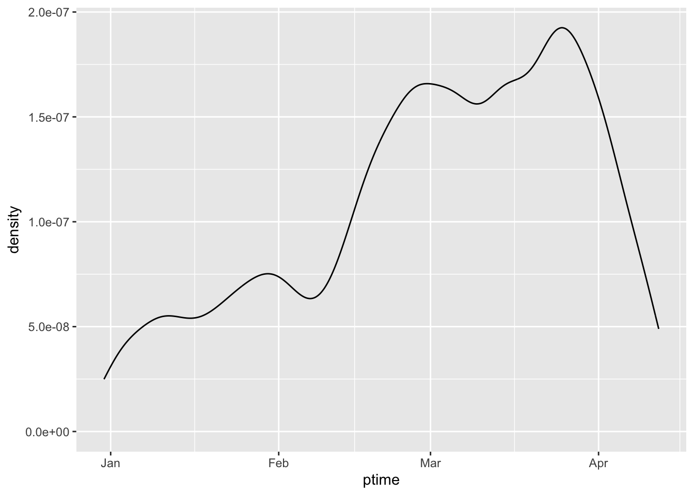
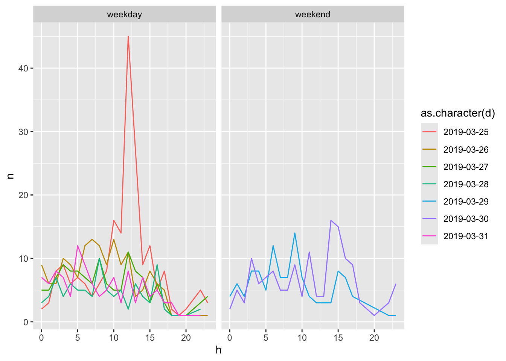

# Processing Timeline {#timeline}

## Time object

在當前的數位時代，網路上充斥著豐富的開放資料，許多其中包含著關鍵的時間資訊，如訂單成立的時間、氣象觀測的時刻以及股票的交易時間等。這些時間數據往往以字串形式存在，但若需進行時間計算或構建時間序列分析，在程式處理前必須將其轉化為專門的時間物件。

在R語言中，主要有兩種時間物件：**`POSIXct`**和**`POSIXlt`**，它們可通過**`as.POSIXct()`**和**`as.POSIXlt()`**函數將字串轉換成相應的時間物件形式。一旦轉換完成，各種時間相關的計算操作，如時間點之間的差異計算、時區轉換、時間序列的特定區間提取等，便可輕鬆進行。具體而言，**`POSIXct`**是以1970年1月1日00:00:00 UTC至當前的總秒數來表示時間點，適合於進行數學計算；而**`POSIXlt`**則採用結構化列表形式存儲，包括年、月、日、小時、分、秒等時間單位，更便於人工閱讀與理解。這兩種時間物件的主要差異在於，**`POSIXct`**較為適合於計算處理，**`POSIXlt`**則在時間元素的展示與處理上更為直觀。

此外，利用**`Sys.time()`**函數能夠獲取當前時刻的時間物件，這為時間數據的動態處理提供了便利。學習如何有效運用這些時間物件進行日期與時間的計算在許多領域，例如金融、氣象、交通等，都是非常關鍵的能力。


## Example: Processing time object in social opinions

### Char-to-Time

在 R 裡面，我們可以使用 `strptime()` 函數將字串轉換為時間物件，其中 `%Y`、`%m`、`%d`、`%H`、`%M`、`%S` 等是用來表示時間的格式碼。在這段程式碼中，我們使用 `strptime()` 函數將 `ptime` 這個字串轉換為一個時間物件，其中 `%Y-%m-%dT%H:%M:%SZ` 是該字串的時間格式，也就是說這個字串是以 ISO 8601 的格式表示的時間，例如 `2022-03-31T14:30:00Z`。`tz = "ASIA/Taipei"` 則是指定時間所在的時區，這裡指定的是台灣時間。轉換完成後，我們使用 `as.POSIXct()` 函數將 `strptime()` 轉換出來的時間物件再轉換為`POSIXct`時間物件，並將其存入 `ptime` 這個欄位中。這段程式碼的作用是將一個 ISO 8601 格式的字串轉換為 `POSIXct` 時間物件，並指定時區為台灣，方便之後進行時間相關的運算。

在 **`strptime()`** 函數中，可以使用不同的格式碼來指定時間的格式。以下是常用的幾種格式碼及其意義：

-   **`%Y`**：四位數的年份，例如 2022。
-   **`%m`**：兩位數的月份，範圍是 01 到 12。
-   **`%d`**：兩位數的日期，範圍是 01 到 31。
-   **`%H`**：兩位數的小時，範圍是 00 到 23。
-   **`%M`**：兩位數的分鐘，範圍是 00 到 59。
-   **`%S`**：兩位數的秒數，範圍是 00 到 59。
-   **`%b`**：縮寫形式的月份名稱，例如 Jan。
-   **`%B`**：完整形式的月份名稱，例如 January。
-   **`%a`**：縮寫形式的星期幾名稱，例如 Mon。
-   **`%A`**：完整形式的星期幾名稱，例如 Monday。
-   **`%p`**：AM 或 PM，例如 AM。

在 **`strptime()`** 函數中，你可以使用這些格式碼來指定一個字串的時間格式，以便將其轉換為時間物件。例如，如果一個字串的格式是 **`2022-03-31 14:30:00`**，那麼可以使用 **`%Y-%m-%d %H:%M:%S`** 這個時間格式來將其轉換為一個時間物件。


```r
# Reading from url
# ptturl <- "https://github.com/P4CSS/R4CSSData/raw/main/ptt_hang_posts.csv"
# raw <- read.csv(url(ptturl))


# read_csv() won't convert timestamp to POSIXct automatically
# raw <- read.csv("data/ptt_hang_posts.csv")
# clean <- raw %>%
#         mutate(ptime = as.POSIXct(strptime(ptime, "%Y-%m-%dT%H:%M:%SZ")))


# read_csv() will convert timestamp to POSIXct automatically
clean <- read_csv("data/ptt_hang_posts.csv")
```


```r
t <- "2019-04-12T00:48:19Z"
class(t)
```

```{.output}
## [1] "character"
```

```r
?strptime
t1 <- strptime(t, "%Y-%m-%dT%H:%M:%SZ")
clean %>% head # %>% View
```

```{.output}
## # A tibble: 6 × 7
##   plink                  board pcontent poster ptitle ptime               ipaddr
##   <chr>                  <chr> <chr>    <chr>  <chr>  <dttm>              <chr> 
## 1 https://www.ptt.cc/bb… Hate… "\n\n韓… loveb… Re: [… 2019-04-12 02:21:14 83.22…
## 2 https://www.ptt.cc/bb… Hate… "\n\n\n… ikr36… Re: [… 2019-04-12 02:13:45 114.4…
## 3 https://www.ptt.cc/bb… Hate… "\n\n正… sunye… Re: [… 2019-04-12 02:10:18 118.1…
## 4 https://www.ptt.cc/bb… Hate… "\n:\n\… rock7… Re: [… 2019-04-12 02:03:14 118.1…
## 5 https://www.ptt.cc/bb… Hate… "\n\n我… btm97… Re: [… 2019-04-12 02:01:12 101.1…
## 6 https://www.ptt.cc/bb… Hate… "\n\n\n… cblade [討論… 2019-04-12 01:55:06 180.2…
```

### Density plot along time

在資料分析的過程中，我們經常需要對資料進行分布分析，以了解資料的特性。**`ggplot2`** 套件提供了 **`geom_density()`** 函數，可以用來繪製密度圖（density plot）。密度圖顯示了一個連續變量的概率密度函數的近似值，可以用來了解該變量的分佈情況。密度圖與直方圖類似，但它是基於核密度估計方法繪製的，所以在某些情況下可以提供更好的分佈近似。它將一個連續變量區間劃分為若干個小區間，然後對每個小區間的密度進行估計，再將這些小區間的密度估計值連接起來，形成一條平滑曲線，用以描述變量的分佈情況。

在 **`ggplot2`** 中，使用 **`geom_density()`** 函數可以很方便地繪製密度圖。我們只需要指定變量名稱，即可繪製出該變量的密度圖。此外，我們也可以使用 **`stat_density()`** 函數來繪製密度圖，這個函數允許我們對密度圖進行更多的自定義設置，例如指定核函數、調整帶寬等。繪製密度圖可以讓我們更直觀地了解變量的分佈情況，進而對資料進行更深入的分析和探索。


```r
clean %>%
    ggplot() + aes(ptime) + 
    geom_density()
```



### Freq by month

如果想要詳細觀察逐年逐月的變化，使用密度圖可能不夠直觀，此時可以考慮使用直方圖來呈現資料。直方圖可以將資料劃分為若干個等寬的區間，並計算每個區間內資料的頻率，然後將這些頻率顯示為長方形柱，以反映資料的分佈情況。對於時間序列資料，我們可以將其劃分為月、週等時間單位，然後計算每個時間單位內資料的出現次數，再使用 **`ggplot2`** 中的 **`geom_col()`** 函數繪製直方圖。

以上程式碼中，我們使用 **`mutate()`** 函數將 **`ptime`** 欄位轉換為月份 **`m`**，然後使用 **`count()`** 函數計算每個月份出現的次數。接著使用 **`ggplot()`** 函數初始化一個 **`ggplot`** 對象，指定 **`aes()`** 函數的 **`x`** 軸為月份 **`m`**，**`y`** 軸為出現次數 **`n`**，然後使用 **`geom_col()`** 函數繪製直方圖。這樣可以很直觀地看到每個月份資料的出現次數，進而觀察到逐年逐月的變化趨勢。如果需要更詳細的觀察，可以將資料劃分為更小的時間單位，例如週，然後使用類似的方法繪製直方圖。


```r
?lubridate
clean %>%
    mutate(m = month(ptime)) %>% 
    count(m) %>%
    ggplot() + aes(m, n) + 
    geom_col()
```


### Freq-by-date (good)

在處理時間序列資料時，我們常常需要將資料劃分為不同的時間單位，例如月、週、日等，以便進行更精細的分析和視覺化。然而，如果只是單純地提取出時間序列資料中的某一個時間單位，例如月份，就會失去時間軸在年的特性，因此需要採取一些方法來保留日期（如年）的特性。

以上程式碼中，我們使用 **`filter()`** 函數選取了時間範圍為 2019 年 3 月 18 日到 4 月 1 日的資料，然後使用 **`floor_date()`** 函數將每個時間點取整為當天的起始時間，以保留日期（如年）的特性。這樣可以確保同一天的資料都被歸到同一個時間單位中，進而保留時間軸在年的特性。接著使用 **`count()`** 函數計算每個時間單位內資料的出現次數，再使用 **`ggplot()`** 函數和 **`geom_col()`** 函數繪製直方圖，可以看到在時間軸上的年份特性被保留了下來。

總之，當我們需要從時間序列資料中提取某一個時間單位時，應該採用能夠保留日期（如年）特性的方法，例如使用 **`floor_date()`** 函數，以便進行更加精細的分析和視覺化。


```r
clean %>%
    filter(ptime >= as_date("2019-03-18") & ptime < as_date("2019-04-01")) %>%
    mutate(m = floor_date(ptime, unit = "day")) %>% 
    count(m) %>%
    ggplot() + aes(m, n) + 
    geom_col()
```


### Freq-by-hour

透過觀察資料在週末和週間的變化，可以幫助我們了解不同時間段的資料分佈情況。以下是一個範例程式碼，可以根據每天的時間點和文章數來觀察資料在週末和週間的變化。相較於將資料分為週間和週末，這個範例程式碼使用 X 軸作為 24 小時的時間點，而 Y 軸為不同日期的文章量，使用分組的方式，針對不同日期繪製折線圖，最後使用 **`facet_wrap()`** 函數將資料分成週末和週間兩個子圖來進行比較。

首先，我們使用 **`filter()`** 函數選取時間範圍為 2019 年 3 月 25 日到 4 月 1 日的資料。接著，使用 **`floor_date()`** 函數將每個時間點取整為當天的起始時間，以便進行統計。然後，使用 **`hour()`** 函數取出每個時間點的小時數，以及使用 **`count()`** 函數計算每個時間點和日期的文章數。接著，使用 **`wday()`** 函數取出每個日期的星期幾，並使用 **`ifelse()`** 函數將週末和週間的日期標記為不同的類別。最後，使用 **`ggplot()`** 函數初始化一個 **`ggplot`** 對象，指定 **`aes()`** 函數的 **`x`** 軸為小時數 **`h`**，**`y`** 軸為文章數 **`n`**，以及日期 **`d`** 的類別 **`color`**。然後，使用 **`geom_line()`** 函數繪製折線圖，並使用 **`facet_wrap()`** 函數將資料分為週末和週間兩個子圖。

透過這樣的方式，我們可以很清楚地看到週末和週間的文章量變化趨勢，從而對資料進行更深入的分析和探索。


```r
clean %>%
    filter(ptime >= as_datetime("2019-03-25") & ptime < as_datetime("2019-04-01")) %>%
    mutate(d = floor_date(ptime, unit = "day")) %>%
    mutate(h = hour(ptime)) %>%
    count(d, h) %>%
    mutate(wd = wday(d, label = F, locale = Sys.getlocale("LC_TIME"))) %>%
    mutate(isweekend = ifelse(wd >= 6, "weekend", "weekday")) %>%
    ggplot() + aes(h, n, color = as.character(d)) + 
    geom_line() + 
    facet_wrap(~isweekend)
```



```r
?ifelse
```
