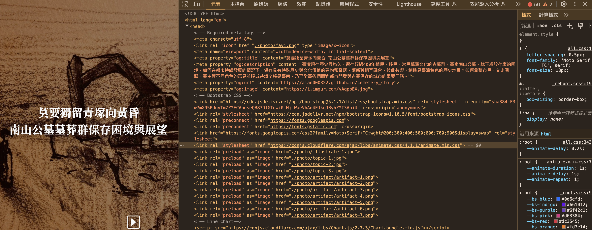

# (PART) CRAWLER {.unnumbered}

# Introduction to Web Scraping {#crawler-overview}

## Webpage Browsing

我們常說「上網」，但實際上當我們把網址輸入網址列後，執行所產生的動作是，到該網址的伺服器把該網頁和網頁相關的頁面給抓回來在瀏覽器上重組起來。

比方說，<https://alan000322.github.io/cemetery_story/>這個結構簡單的學生作品，當我們打開 Chrome DevTools來看輸入網址後發生了什麼事。首先他仔入的第一頁是cemetery_story/，然後連續載入很多個`.jpg`檔、和`.js`檔，也常有`css`檔。css是用來處裡網頁的視覺表現的，新的css3也可以帶入一些簡單的動態；js則是用來處理網頁動態的。

Chrome DevTools的頁面明白的表示，當你輸入這個網址時，其實是你向伺服器端要求了這些頁面，而瀏覽器照網頁頁面內容把這些頁面依序抓回來，然後在使用者端的瀏覽器上重組。如此說的話「上網」的概念就有點怪怪的，其實是「載網」，把網路內容載到自己的瀏覽器上來。

但瀏覽器怎麼會知道要抓這些檔案？而不是別的？原因是你載入的第一個頁面（如下圖），上面就有很多的超鏈結，鏈結到圖片、影片、js或css。當瀏覽器讀到這個頁面有這些鏈結時，瀏覽器就會把這些鏈結所指到的頁面用request的方式給要回來。



## Scraper

所以，所有上網的動作，都可以說是你透過瀏覽器和對方的伺服器之間的檔案傳輸，當你送出的網址內的HTML包含了其他的鏈結（例如鏈結到的CSS、JavaScript或圖檔），那瀏覽器就會依序把這些東西給載回本地端並重組成網頁。這部分你需要了解：

1.  上網就是發出requests給對方伺服器，然後你接受對方伺服器給傳回來的response，反覆的動作。

2.  HTTP 協議：HTTP 協議是網絡通信協議，用來讓網頁伺服器告訴要求服務的瀏覽器，他這次request所要求的資源是否成功獲取，或失敗。我們可以藉此理解 HTTP 協議可以幫助理解網頁如何工作。例如最常見的HTTP回應代碼有「401 Unauthorized：未經授權，無法訪問所需內容」以及「404 Not Found：所請求的內容不存在」。

3.  防止反爬：由於網站經常會採取反爬蟲措施，因此開發者需要學習如何繞過這些措施，例如使用代理服務器、設置間隔時間、更換用戶代理等。

## Type of Scraper

**Type 0.** 第零類是使用網站所提供的 API，API 是指應用程式介面，是網站提供的一種接口，用戶可以通過 API 向網站發送請求，獲取網站數據。API 可以是 RESTful API、SOAP API、XML-RPC API 等等，使用 API 的好處是可以直接獲取需要的數據，且數據格式結構化，易於處理。不過使用 API 需要瞭解 API 的參數格式，而且不是所有網站都提供 API。常見且提供API讓客戶端來取用資料的社群網站服務包含：

1.  Google Maps API：提供地圖、地理位置等相關的 API。
2.  Twitter API：提供關於 Twitter 的相關數據，包括推文、用戶資訊等。
3.  Facebook API：提供關於 Facebook 的相關數據，包括用戶資訊、頁面資訊等。
4.  GitHub API：提供關於 GitHub 的相關數據，包括存儲庫資訊、用戶資訊等。
5.  OpenWeatherMap API：提供天氣資訊的 API。
6.  YouTube API：提供關於 YouTube 的相關數據，包括影片、頻道等。
7.  Spotify API：提供關於音樂的相關數據，包括歌曲、歌手等。

### **Type 1. Response with JSON**

第一類是，我們觀察到，我們所想要下載的資料，就跟Web API一樣，被服務的後端以Rest API的方式提供給前端。這類服務通常使用AJAX的方式來產生網頁，常見於社群網站、電子商務、新聞媒體、或者一些資訊服務的網站。他一開始會載入一個基本的HTML框架頁，然後每個搜尋的結果、無論是新聞或者貼文，則是以JSON的方式被嵌入HTML的框架頁。當使用者要求後續的頁面，伺服器只要把後續頁面的資料用JSON傳回來，瀏覽器就會在本地端把這些JSON嵌入到HTML的框架頁中。因此，要設計這類服務的爬蟲，只需要找到相對應被傳回來的JSON檔，並且將其剖析為R的物件即可。這類服務目前常見的如鉅亨網、104求職網、PCHome 24h購物網站的搜尋結果。

JSON 是一種輕量級的數據交換格式，可以被多種語言解析和生成，是目前 Web API 應用中使用最廣泛的數據格式之一。JSON 的全稱是 JavaScript Object Notation，為基於 JavaScript 語言的一種文本格式，可以被解析為不同的資料型態，如數字、布林代數、字串、數值組和物件等。JSON 與 XML 相比，具有更輕量級、更容易讀寫和解析等優勢，也因此在 Web API 中被廣泛應用。

JSON 格式的基本結構是一個鍵-值對應（Key-Value）集合，其中每個鍵都是一個字串，每個值可以是數字、布爾值、字串、數組或對象等類型。例如，以下是一個簡單的 JSON 。在 JSON 中，可以使用大括號 `{}` 表示鍵值對應（Key-Value），使用中括號 `[]` 表示序列（類似R中的List），鍵和值之間用冒號 `:` 分隔以對應，不同的鍵值對之間用逗號 `,` 分隔。JSON可以是樹狀多階層的，即一個鍵的值可以是另一個 JSON物件的鍵值對應。

在 R 語言中讀取 JSON 檔案需要先將其轉換為 R 的物件。這可以使用 R 的 jsonlite 套件中的 `fromJSON()` 函數來實現。`jsonlite` 套件是一個方便解析 JSON 的工具，它提供了從 JSON 字符串到 R 物件之間的轉換功能。

```         
{
    "name": "John",
    "age": 30,
    "isMarried": false,
    "hobbies": ["reading", "music", "movies"],
    "address": {
        "street": "123 Main St",
        "city": "Anytown",
        "state": "CA"
    }
}
```

### Type 2. HTML Parsing {#craw_scraping}

但並不是所有的服務都會用AJAX的做法，而是伺服器直接照使用者的要求或查詢，在伺服器端直接傳回已經組織好的HTML給使用者。因此，使用者收到的是一個HTML檔，而不像Type 1一樣可以找到JSON格式的response。既然收到的是HTML檔，那就要想辦法剖析這個HTML檔把要取的資料給結構化地節取出來。因此，這時候需要的就是一個HTML剖析器（HTML Parser）。例如PTT、LTN等都是這類服務。

1.  HTML 和 CSS：這些是用於設計和呈現網頁的標準技術。HTML 是網頁的基礎架構，而 CSS 用於設計和美化網頁的外觀。例如了解了解 HTML 標籤和屬性的基本語法和用法，以及網頁的基本結構，例如 head、body、div、span、table、a 等等。並瞭解了解 CSS 的基本語法和用法，包括如何設置元素的樣式、顏色、字體、大小、邊框等等，以及常用的選擇器和屬性。

2.  Class和id的概念。通常伺服器端的前端設計師，會用id來標記某些特定的HTML功能區塊，而用class來標記一些反覆出現的區塊，例如像一個搜尋頁面預期要傳回來20篇新聞，總要有些標記能標記出，到底這20篇新聞要視覺化成什麼樣子。

3.  XPath 和 CSS 選擇器：XPath 和 CSS 選擇器是用於定位 HTML 元素的語言。XPath 是 XML 語言的一部分，而 CSS 選擇器是 CSS 的一部分。Chrome 瀏覽器的 Inspector 是一個強大的工具，可以幫助我們查找 HTML 元素的 XPath 和 CSS 選擇器。

## Supplementary Materials

### HTTP Status Code {#status_code}

回應代碼用於向客戶端通報伺服器對請求的處理狀態，以便客戶端根據不同的回應代碼進行相應的處理。例如，當客戶端發送一個請求到服務器時，如果服務器返回的回應代碼是 200 OK，這意味著該請求已經成功處理，服務器已經返回所需的內容，客戶端可以根據返回的內容進行下一步操作；如果服務器返回的是 404 Not Found，這意味著客戶端所請求的內容不存在，客戶端需要提示用戶請求的資源不存在。以下是 HTTP 協議中常見的一些代碼：

1.  1xx（Informational）：這些代碼表示服務器已經接收到請求，但仍在處理中。

2.  2xx（Successful）：這些代碼表示請求已經成功處理。

3.  3xx（Redirection）：這些代碼表示客戶端需要採取進一步的操作才能完成請求。

4.  4xx（Client Error）：這些代碼表示客戶端發生了錯誤，請求無法完成。

5.  5xx（Server Error）：這些代碼表示服務器發生了錯誤，無法完成請求。

以下是常見的 HTTP 協議代碼：

-   200 OK：請求已經成功處理，並返回所需的內容。

-   301 Moved Permanently：請求的網頁已經永久轉移到新位置。

-   302 Found：請求的網頁暫時轉移到新位置。

-   400 Bad Request：請求的語法不正確。

-   401 Unauthorized：未經授權，無法訪問所需內容。

-   403 Forbidden：已經獲得授權，但仍無法訪問所需內容。

-   404 Not Found：所請求的內容不存在。

-   500 Internal Server Error：服務器內部錯誤，無法處理請求。

### Using Chrome DevTools

Chrome DevTools是一款由Google開發的網頁開發工具，可以幫助開發人員進行網頁測試、網頁性能分析、網頁設計等工作。DevTools提供了豐富的功能，包括元素查看器、Console、網絡監測器、源代碼編輯器等，可讓開發人員在開發過程中快速找到和解決問題。此外，DevTools還可以幫助開發人員模擬不同設備、網速，以及對網站進行性能分析和優化，提高網站的速度和使用體驗。

### Observing web request

在開始網頁爬蟲之前，我們需要找到網頁中的JSON數據，以便進行後續的數據提取和處理。使用Chrome DevTools可以很容易地找到網頁背後的JSON檔案。以下是一些步驟：

1.  打開Chrome瀏覽器，進入要爬取的網站。

2.  按下F12鍵或右鍵點擊網頁上的任意位置並選擇「檢查」來開啟DevTools。

3.  在DevTools中，選擇「Network」分頁。

4.  在瀏覽器中執行您要查找JSON數據的操作，例如點擊一個按鈕或輸入一個查詢。

5.  在DevTools的網絡監測器中，您可以看到所有網頁請求（Request）和回應（Response），包括我們感興趣的JSON檔案。如果您只想查看JSON請求，可以在過濾器中輸入「json」。

6.  點選JSON請求，您可以查看Request和Response中的的詳細信息，包括URL、Headers、Request Payload和Response等。

7.  在Response分頁中，您可以看到JSON數據的內容。如果JSON數據很大，您可以右鍵點擊JSON數據，然後選擇「Save Response As...」將其保存到本地檔案中。
